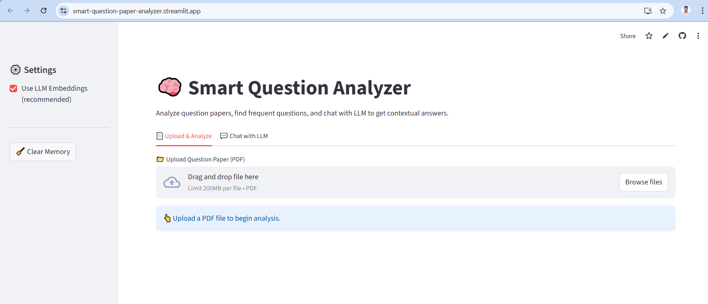
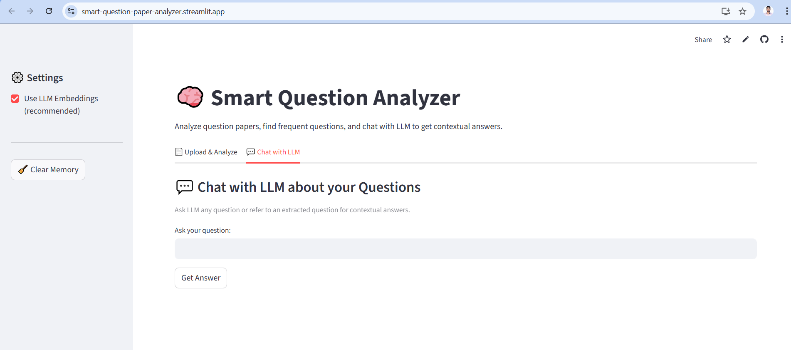

# Smart Question Analyzer

An end-to-end Streamlit app + modular Python pipeline to extract, cluster, and answer questions from uploaded PDFs using OCR, embeddings, and a configurable LLM backend (default: Gemini 1.5 Flash).

## Overview

Smart Question Analyzer is an end-to-end Generative AI project that:
1. Accepts multiple PDF question papers (image or text-based)
2. Extracts questions automatically using OCR + NLP
3. Finds most frequent questions across papers
4. Lets you chat with Google Gemini to get detailed, AI-powered answers
Built with Python · Streamlit · Google Gemini 2.5 Flash · OCR · NLP · RAG concepts

## Features
- Upload multiple PDFs (any question papers).
- Convert PDF pages to images and run OCR.
- Extract candidate questions using heuristics.
- Create embeddings, cluster similar questions, and rank by frequency.
- Retrieval-Augmented Generation (RAG) answers using Gemini (default) or other LLMs.
- Streamlit UI with Upload, Analysis, and Chat pages.

## Structre 

```text
smart-question-analyzer/
│
├── app/
│   └── streamlit_app.py          # Streamlit main app
│
├── src/
│   ├── pdf_parser.py             # PDF & OCR pipeline
│   ├── ocr_engine.py             # Tesseract-based OCR
│   ├── question_extractor.py     # Regex/NLP-based question extraction
│   ├── text_cleaner.py           # Text normalization & frequent question logic
│   ├── embedding_engine.py       # Gemini + SentenceTransformer embeddings
│   ├── rag_retriever.py          # Retrieval-augmented search
│   ├── llm_interface.py          # Gemini 2.5 Flash API interface
│   └── config.py                 # Config loader (st.secrets / .env)
│
├── requirements.txt
├── Dockerfile
├── README.md
└── .env.example
```


## Run the App Locally

https://smart-question-paper-analyzer.streamlit.app

## Security Notes

The Gemini API key is stored only on the backend (never exposed).
Free-tier keys from AI Studio are supported.
Supports both text-based and image-based PDFs.

## App Preview

### Tab 1
<p align="center">
  
</p>

### Tab 2:
<p align="center">
  
</p>
